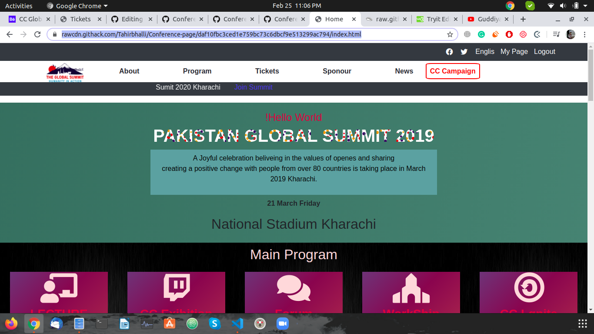
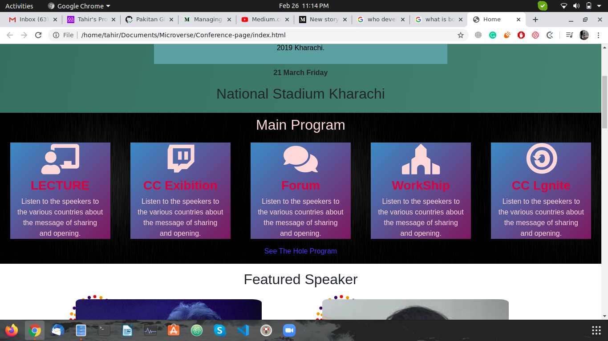
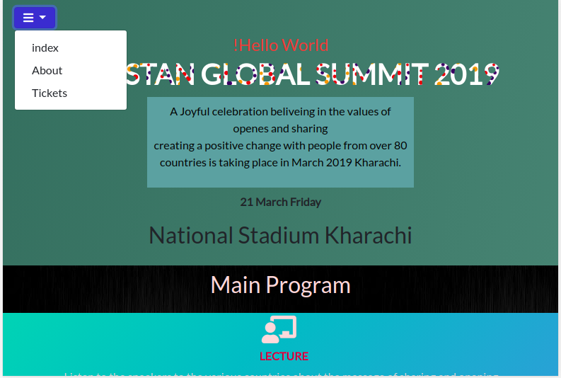
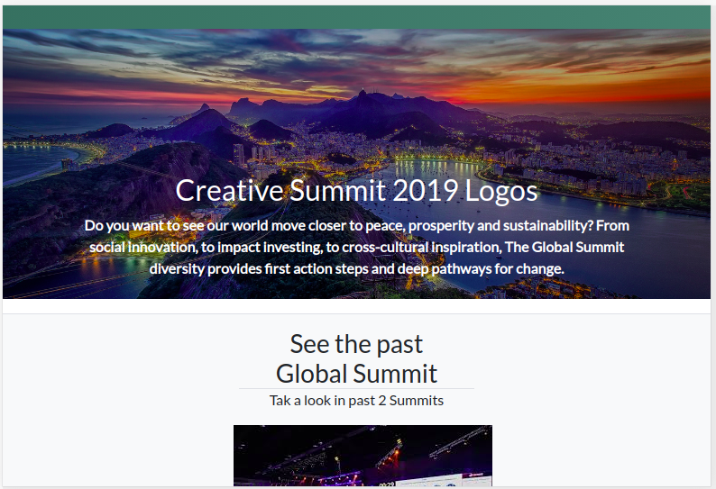

# Conference-page

This is the solo project for Pakistan Summit 2020. Which is build with HTML 5 and CSS 3 and Bootstrap 4. 

## Built With

- Html,
- CSS

## Fonsts

-Lato 
-cocogoose

## Live Demo

[Live Demo Link](https://rawcdn.githack.com/Tahirbhalli/Conference-page/65ad3df0a91c4662d2df2accdcdb12489c6f320c/index.html)

## Live Video Presentation
[Live Video Demo](https://www.loom.com/share/684b9d5eb0784b8cbf920f756d48d74a)

## Authors

👤 **Author1**

- Github: [Tahir Ahmad](https://github.com/tahirbhalli/)

## 🤝 Contributing

Contributions, issues and feature requests are welcome! Start by:
* Forking the project
* Cloning the project to your local machine
* `cd` into the Youtube-Replica project directory
* Run `git checkout -b your-branch-name`
* Make your contributions
* Push your branch up to your forked repository
* Open a Pull Request with a detailed description to the development branch of the original project for a review

## 📝 License

This project is [MIT](https://opensource.org/licenses/MIT) licensed.
